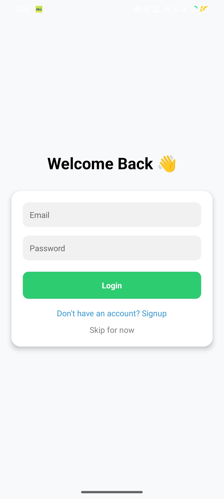
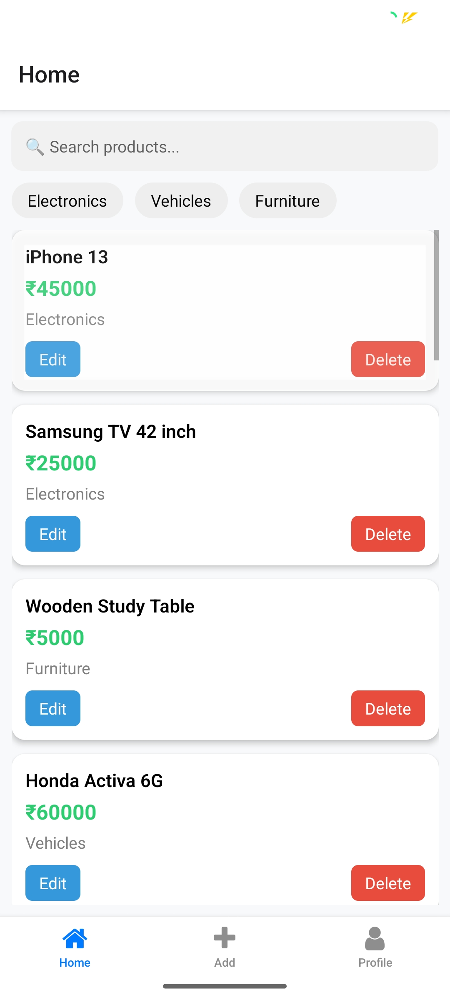
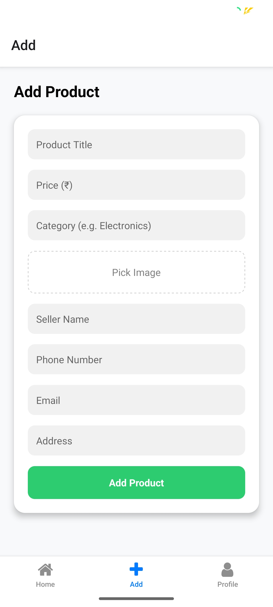
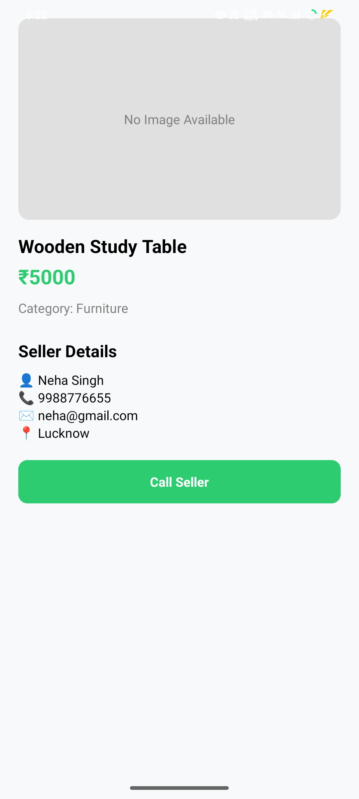
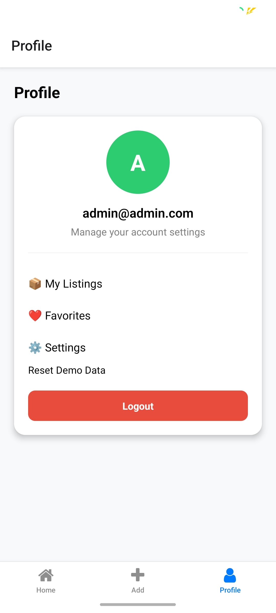

# 🛒 Smart Marketplace App (React Native + Expo)

A modern mobile marketplace app built using React Native and Expo. Users can browse, add, edit, and manage products with seller details and persistent storage.

---

## 🚀 Features

- 🔐 Authentication (Login / Signup / Skip)
- 📦 Add, Edit, Delete Products
- 🔍 Search & Filter Products
- 🖼️ Image Upload (Expo Image Picker)
- 👤 Seller Details (Name, Phone, Email, Address)
- 📞 Contact Seller (Call integration)
- 💾 Local Storage (AsyncStorage)
- 📱 Modern UI (Clean & Responsive)
- 🔄 Persistent Data + Demo Data Support

---

## 📸 Screenshots

- Login Screen  
  
- Home Screen  
  
- Add Product  
  
- Product Details  
  
- Profile Screen  
  

## 🛠️ Tech Stack

- React Native (Expo)
- TypeScript
- Context API (State Management)
- AsyncStorage (Local Database)
- Expo Router (Navigation)

---

## 📂 Folder Structure

app/
├── (tabs)/
│ ├── home.tsx
│ ├── add.tsx
│ ├── profile.tsx
├── product/
│ └── [id].tsx
├── login.tsx
├── signup.tsx
├── index.tsx

context/
├── AuthContext.tsx
├── ProductContext.tsx

---

## ⚡ Getting Started

```bash
npm install
npx expo start
```

---

## 🎯 Future Improvements

- Firebase Backend Integration
- Real-time Chat System
- Wishlist / Favorites
- Image Upload to Cloud
- Location-based Listings

---

## 🙌 Author

Shahbaz Ahmad
Frontend Developer (React.js / React Native)

---
